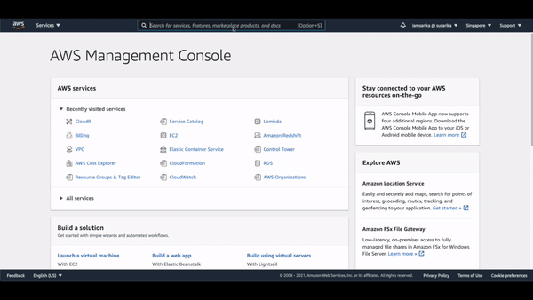
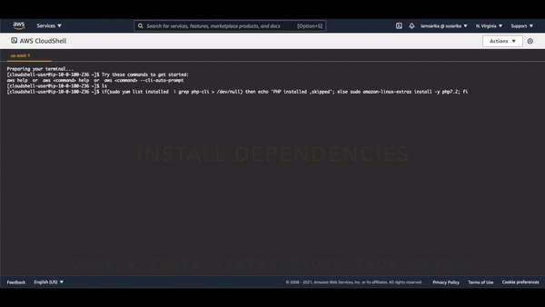
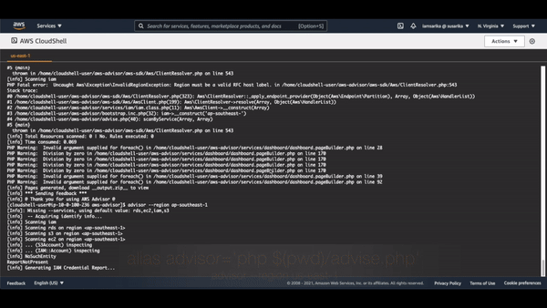
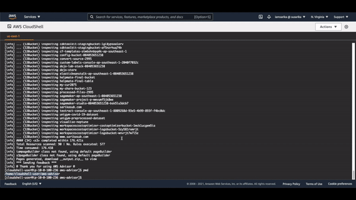
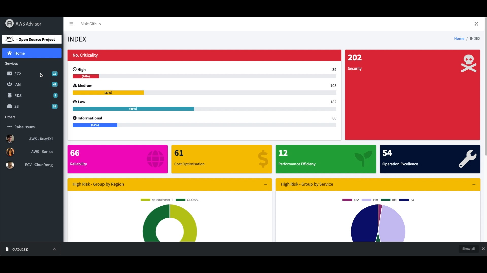

# aws-advisor

This is an unofficial guidance tool for the AWS environment.

## Overview
AWS Advisor is a tool that allows AWS customers to automate checks on their environment and services based on the [AWS Well Architected Framework](https://aws.amazon.com/architecture/well-architected/). The purpose of this tool is to provide recommendations on how to improve upon existing setup and configuration. This is not intended to be a replacement of the [AWS Well Architected Tool](https://aws.amazon.com/well-architected-tool/) but rather a complement to it. 

## Prerequisites
1. Please review the [DISCLAIMER](./DISCLAIMER.md) before proceeding. 
2. You must have an existing AWS Account.
3. You must have an IAM user with sufficient read permissions for all of the services to be reviewed. See example [here](https://docs.aws.amazon.com/IAM/latest/UserGuide/reference_policies_examples_iam_read-only-console.html). The user must also have full access to AWS CloudShell i.e. AWSCloudShellFullAccess. 
4. [Login to your AWS account](https://docs.aws.amazon.com/cloudshell/latest/userguide/getting-started.html#start-session) using the above IAM user. 
5. Launch your [AWS CloudShell](https://docs.aws.amazon.com/cloudshell/latest/userguide/getting-started.html#launch-region-shell) - use may use any region



## Installing aws-advisor
In CloudShell terminal, run this to install php:
```bash
if(sudo yum list installed  | grep php-cli > /dev/null) then echo 'PHP installed ,skipped'; else sudo amazon-linux-extras install -y php7.2; fi
## aws-sdk requires mbstring and xml
if(sudo yum list installed | grep php-mbstring > /dev/null) then echo 'php-mbstring installed, skipped'; else sudo yum install php-mbstring -y; fi
if(sudo yum list installed | grep php-xml > /dev/null) then echo 'php-xml installed, skipped'; else sudo yum install php-xml -y; fi
## remove existing old version of advisor
rm -rf aws-advisor
git clone https://github.com/KuetTaiAWS/aws-advisor.git
```



## Using aws-advisor
```bash
cd aws-advisor
alias advisor='php $(pwd)/advise.php'
## advisor --region <REGION_NAME(S)> --services <SERVICE_NAME(S)>
```

When running advisor, you can specify the regions you want it to run on, as well as the service(s) you want. Currently, you can choose to run it on EC2, RDS, IAM and S3. 
See below for examples:
```bash
## Singapore region only, and S3 service only
advisor --region ap-southeast-1 --services s3

## Both Singapore & N. Virginia region with all services (EC2, IAM, RDS, & S3 for now)
advisor --region ap-southeast-1,us-east-1

## Both Singapore & N. Virginia region with RDS & IAM
advisor --region ap-southeast-1,us-east-1 --services rds,iam
```



The output is generated as an output.zip file. 
You can [download the file](https://docs.aws.amazon.com/cloudshell/latest/userguide/working-with-cloudshell.html#files-storage) in the CloudShell console. 



Once downloaded, unzip the file and open 'index.html' in your browser. You should see a page like this:



Ensure that you can see the service(s) run on listed on the left pane.
You can navigate to the service(s) listed to see detailed findings on each service. 


## Contributing to aws-advisor
We encourage public contributions! Please review [CONTRIBUTING](./CONTRIBUTING.md) for details on our code of conduct and development process.

## License
[](./LICENSE)
